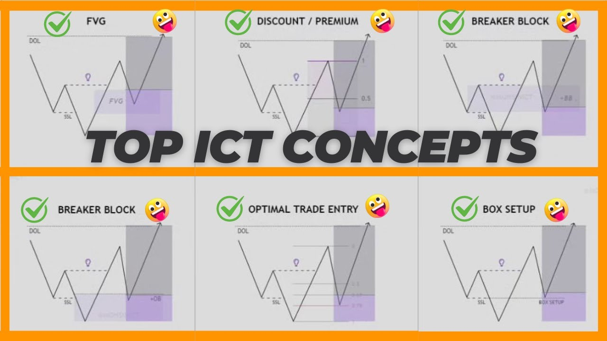

>RektProof Setups 是一种交易策略，主要用于帮助交易者在市场中识别入场和出场点。以下是其特点和步骤的简要说明：

### 特点
1. **风险管理**：RektProof Setups 强调风险控制，确保每笔交易的风险在可接受范围内。
2. **技术分析**：利用技术指标和图表模式来识别潜在的交易机会。
3. **情绪分析**：考虑市场情绪和参与者行为，以判断市场的可能走势。
4. **明确的入场和出场点**：提供清晰的交易信号，帮助交易者做出决策。

### 步骤
1. **市场分析**：
   - 观察市场趋势，确定是牛市还是熊市。
   - 使用技术指标（如移动平均线、相对强弱指数等）进行分析。

2. **识别入场点**：
   - 寻找支撑位和阻力位。
   - 观察价格行为，寻找反转信号或突破信号。

3. **设置止损和止盈**：
   - 根据风险管理原则设置止损点，确保潜在损失在可控范围内。
   - 确定止盈点，以锁定利润。

4. **执行交易**：
   - 在确认信号后，执行买入或卖出操作。

5. **监控和调整**：
   - 持续监控市场动态，根据市场变化调整止损和止盈。

### 出入场点
- **入场点**：通常在价格突破关键阻力位或在支撑位反弹时。
- **出场点**：在达到预设的止盈点或市场出现反转信号时。

通过以上步骤，交易者可以更有效地利用 RektProof Setups 来进行交易决策。

